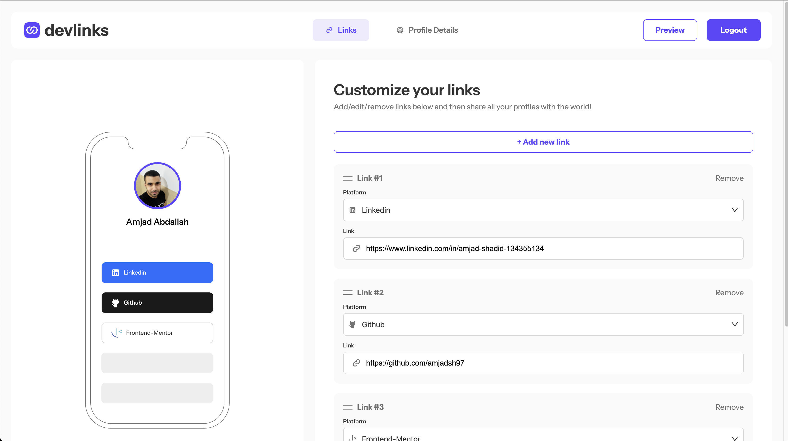

# Frontend Mentor - Link-sharing app solution

This is a solution to the [Link-sharing app challenge on Frontend Mentor](https://www.frontendmentor.io/challenges/linksharing-app-Fbt7yweGsT). Frontend Mentor challenges help you improve your coding skills by building realistic projects.

## Table of contents

- [Overview](#overview)
    - [The challenge](#the-challenge)
    - [Screenshot](#screenshot)
    - [Links](#links)
- [My process](#my-process)
    - [Built with](#built-with)
    - [What I learned](#what-i-learned)
    - [Continued development](#continued-development)
    - [Useful resources](#useful-resources)
- [Author](#author)
- [Acknowledgments](#acknowledgments)


## Overview

### The challenge

Users should be able to:

- Create, read, update, delete links and see previews in the mobile mockup
- Receive validations if the links form is submitted without a URL or with the wrong URL pattern for the platform
- Drag and drop links to reorder them
- Add profile details like profile picture, first name, last name, and email
- Receive validations if the profile details form is saved with no first or last name
- Preview their devlinks profile and copy the link to their clipboard
- View the optimal layout for the interface depending on their device's screen size
- See hover and focus states for all interactive elements on the page
- **Bonus**: Save details to a database (build the project as a full-stack app)
- **Bonus**: Create an account and log in (add user authentication to the full-stack app)

### Screenshot



### Links

- Solution URL: [Add solution URL here](https://github.com/amjadsh97/link-sharing-app)
- Live Site URL: [Add live site URL here](https://link-sharing-app-ten-silk.vercel.app/)

## My process

### Built with

- Semantic HTML5 markup
- CSS custom properties
- Flexbox
- Vite.
- Typescript
- [React](https://reactjs.org/) - JS library
- [React Router Dom](https://reactrouter.com/en/main) - JS library
- [Firebase](https://firebase.google.com/) - backend auth and storage
- [ant design](https://ant.design/components/overview/) - UI components.


### What I learned


```js
//Function to handle the image and store it as string (base-46)
const handleImageChange = (event: ChangeEvent<HTMLInputElement>) => {
	const file = event.target.files?.[0];
	if (file) {
		const reader = new FileReader();
		reader.onload = (e) => {
			const result = e.target?.result;
			if (result !== undefined) {
				setProfileImage(result as string | ArrayBuffer); // Ensure result is not undefined
			}
		};
		reader.readAsDataURL(file);
	}
};

//function to handle links and  user data and save it 
const handleSaveUserData = async () => {
	const auth = getAuth();

	const updatedLinks = links.map(link => ({
		...link,
		...validateUrl(link.platform || '', link.url || '')
	}));

	setLinks(updatedLinks);

	const allValid = updatedLinks.every(link => link.platformValidationMessage === '' && link.urlValidationMessage === '');
	if (!allValid) {
		console.log('Some URLs or platforms are invalid. Please correct them before saving.');
		return;
	}

	if (document.querySelector("body")?.classList.contains("show-profile")) {
		if (!userData.firstName || !userData.lastName) {
			setErrors({
				firstName: !userData.firstName ? 'Please enter your first name' : '',
				lastName: !userData.lastName ? 'Please enter your last name' : '',
			});
			return;
		}
	}

	onAuthStateChanged(auth, async (user) => {

		if (user) {

			const userId = user.uid;

			try {
				const userDocRef = doc(db, 'users', userId);

				// Fetch existing user data
				const userDocSnap = await getDoc(userDocRef);
				const existingData = userDocSnap.exists() ? userDocSnap.data() : {};

				// Combine existing data with new data without duplicates
				const existingLinks = existingData.links || [];
				const newLinks = updatedLinks.filter(link =>
					!existingLinks.some((existingLink:LinkProps) => existingLink.url === link.url)
				);

				const newUserData = {
					...existingData,
					additionalData: userData, // Ensure userData is defined elsewhere in your code
					links: [...existingLinks, ...newLinks], // Merge without duplicates
					profileImage // Add the profileImage
				};

				// Set the user document with the combined data
				await setDoc(userDocRef, newUserData);

				console.log('Data successfully written!');
				showToast(<span> Your changes have been successfully saved!</span>);

			} catch (e) {
				console.error('Error adding data: ', e);
			}
		} else {
			console.error('User is not authenticated.');
		}
	});
};

```

### Continued development

In the future, I will prioritize further developing my skills in making the user experience 
more seamless and intuitive by focusing on responsive design principles. I aim to delve 
deeper into backend development, especially database management and user authentication, 
to enhance the functionality and security of the applications I build. Additionally, I plan
to explore advanced React concepts and state management libraries to optimize performance and
scalability. Continuous learning and experimentation with new technologies will be crucial for
staying updated with industry trends and delivering cutting-edge solutions.


### Useful resources

- [React Docs](https://react.dev/) - This helped me for building react components. I really liked using this docs.


## Author

- Website - [Amjad Shadid](https://amjadshadid.vercel.app/)
- Frontend Mentor - [@amjadsh97](https://www.frontendmentor.io/profile/amjadsh97)
- Twitter - [@Amjadshadid](https://twitter.com/Amjadshadid)
- Linkedin - [@Amjad Shadid](https://www.linkedin.com/in/amjad-shadid-134355134/)